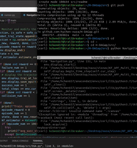

#  	Safe Hierarchical Navigation in Cluttered Dynamic Uncertain Environments

## Table of Contents
- [Introduction](#Introduction)
- [Install](#install)
- [Usage](#usage)
- [Acknowledgments](#Acknowledgments)

## Introduction


Please cite our paper as:

```
@inproceedings{chen2022safe,
  title={Safe Hierarchical Navigation in Crowded Dynamic Uncertain Environments},
  author={Chen, Hongyi and Feng, Shiyu and Zhao, Ye and Liu, Changliu and Vela, Patricio A},
  booktitle={2022 IEEE 61st Conference on Decision and Control (CDC)},
  pages={1174--1181},
  year={2022},
  organization={IEEE}
}
```

## Install

```
pip install future
pip install keras
pip install matplotlib
pip install gym
pip install cvxopt
```

## Usage

```
python Navigation.py --display {none, turtle}
```
If you want to change the number of obstacles in the environment, you can change the obs_num variable in Navigation.py line 36.


## Acknowledgments
Part of the simulation environment code is coming from the course CS 7638: Artificial Intelligence for Robotics in GaTech. We get the permission from the lecturor Jay Summet to use this code for research.
